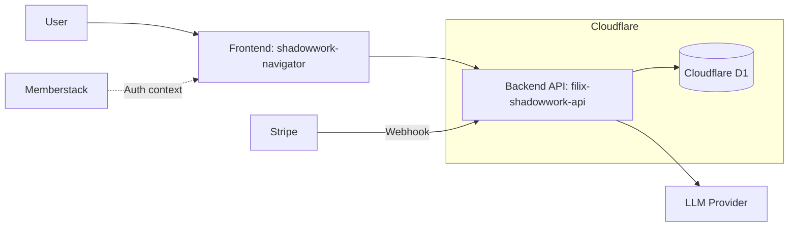
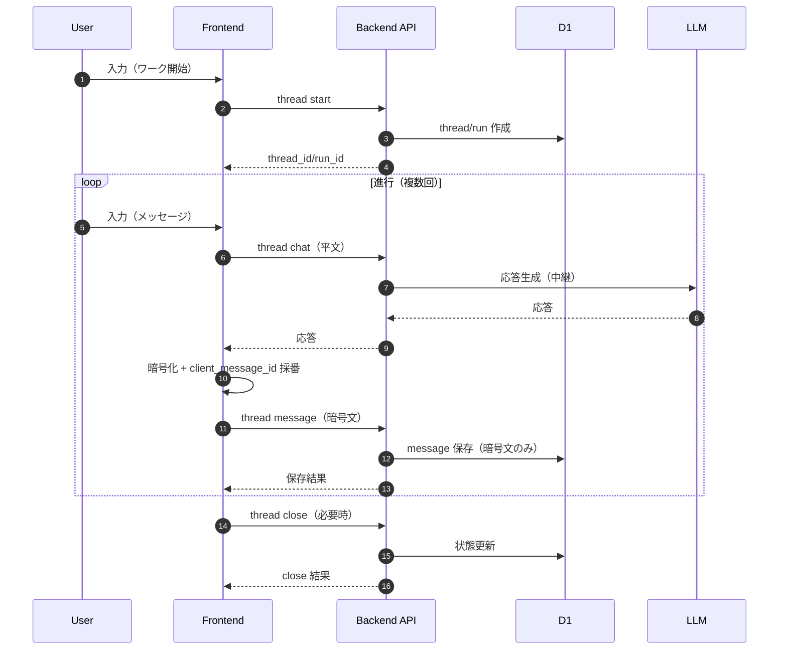
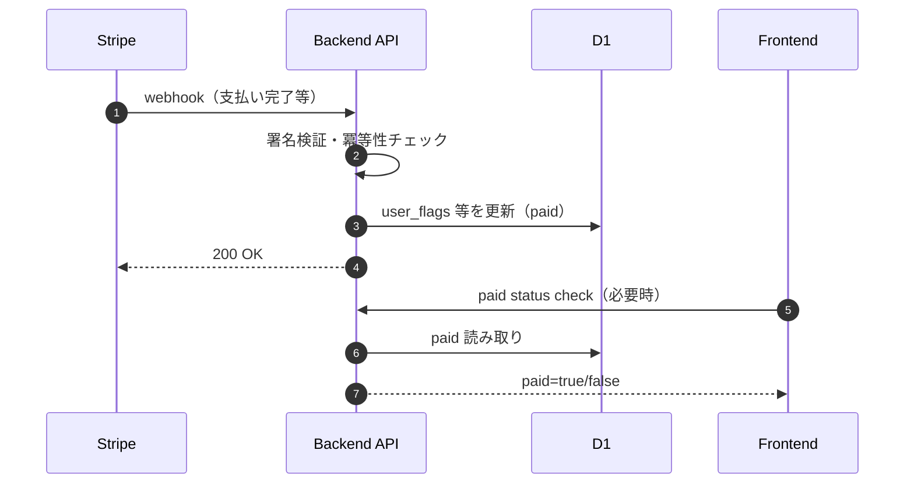

# 00_概要

## システムの目的

Shadowwork Navigator は、ユーザーがシャドウワーク（内省ワーク）を継続できるようにするためのサービスである。  
本リポジトリ（filix-shadowwork-api）は、そのバックエンド API として以下を提供する。

- シャドウワークの進行を「スレッド（thread）」「実行（run）」として管理するための API
- ユーザーの有料状態（paid）にもとづく利用権限の判定と、権限制御の土台
- セッションの記録（メッセージ）と、後から参照するための取得 API
- LLM（大規模言語モデル）との連携のためのサーバー側中継（平文は永続化しない）

目的を一言でまとめると、**フロントエンドがシャドウワーク体験を提供するために必要な、状態管理・永続化・利用権限・LLM連携を、APIとして安定提供すること**である。

## スコープ

### 対象（このバックエンドが責任を持つ範囲）
- **API提供**
  - スレッドの開始／進行／状態取得／終了
  - 実行（run）の開始／再開、履歴の一覧取得
  - メッセージの保存と取得（保存は暗号文のみ）
  - 有料判定（paid）と、それに基づくアクセス許可の判断材料の提供
- **データ永続化**
  - D1 に、スレッド・実行・メッセージ・ユーザーフラグ等を保存
- **外部連携（バックエンド側の境界）**
  - Stripe webhook による paid 更新（冪等性を含む）
  - LLM への問い合わせ中継（`/api/thread/chat`）
- **運用に必要な最小機能**
  - ヘルスチェック、ログ出力、障害切り分けのための最低限の観測点

### 非対象（このバックエンドが責任を持たない範囲）
- **フロントエンド UI / UX**（画面・導線・入力フォーム等）
- **会員登録 / ログイン UI**（Memberstack などの外部サービス側の体験）
- **課金導線の UI**（Checkout / Customer Portal 等の画面提供）
- **マーケティング機能**（メルマガ、キャンペーン、アフィリエイト等）
- **高度な分析・レポート**（BI、行動分析、課金分析のダッシュボード等）
- **LLMの品質チューニングそのもの**（プロンプトや会話設計は別ドキュメントで管理）

## 全体像

以下は「フロントエンド」「バックエンド」「外部サービス」「データストア」の関係を、箱と矢印のレベルで示す。

### 代表的な処理の流れ（例）

#### 1. シャドウワークの開始〜進行〜終了
- フロントエンドが thread を開始し、LLM中継と暗号文保存を分離して進行する
- バックエンドは平文を中継するが保存せず、保存時は暗号文のみ永続化する

#### 2. 課金状態（paid）の更新と利用権限
- Stripe から webhook が届く
- バックエンドが検証し、D1 の paid 状態を更新する
- フロントエンドは、必要に応じて paid 状態を照会し、UI/導線を分岐する

### 用語（本ドキュメントでの最小定義）
- **thread**: 1つの内省ワークの会話単位（開始〜終了まで）
- **run**: thread の進行を「1回の実行」として扱う単位（再開・履歴管理の軸）
- **message**: thread/run に紐づく発話・応答の記録（DB上は暗号文）
- **paid**: 有料状態を示すフラグ（利用権限の判断材料）
