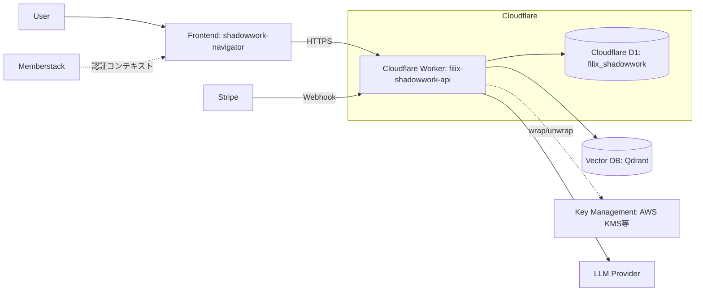
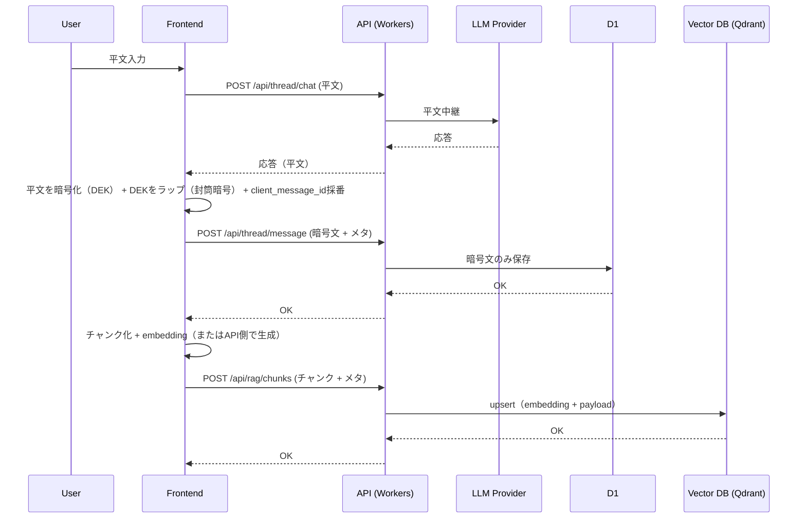

# 10_アーキテクチャ

本章では、Shadowwork Navigator（filix-shadowwork-api）のバックエンドにおける構成要素、責務分担、境界、およびデータの所有権（正の管理主体）を示す。

---

## コンポーネント責務

### Cloudflare Workers（API）
- **役割**: HTTP API の受け口。ルーティング、入力検証、認証・利用権限の判定、D1 への永続化、外部サービス連携を担当する。
- **実体**: `src/worker.ts`（Wrangler `main`）
- **備考**: 本構成では Durable Objects の設定は `wrangler.toml` に存在しないため、必須要素ではない（必要に応じて導入可能）。

### Cloudflare D1（データストア）
- **役割**: スレッド、実行、メッセージ、ユーザーフラグ等の永続化。
- **バインディング**: `DB`
- **備考**: ユーザーの paid 状態（利用権限）の判定材料は D1 上のフラグとして保持する。
- **重要**: ユーザーのメッセージ本文は暗号文として保存し、平文は保存しない。

### Frontend（shadowwork-navigator）
- **役割**: UI/UX、画面遷移、ユーザー入力、API 呼び出し、認証コンテキスト（ログイン状態）の管理。
- **追加責務（メッセージ保護）**:
  - 平文の暗号化/復号（本文は共通鍵で暗号化）
  - 暗号化に用いた共通鍵（DEK）を復号可能にするための情報（ラップ済みDEK等）を、暗号メタとして保存要求に含める（封筒暗号）
  - `client_message_id` の採番
  - 保存失敗時の再試行制御（同一 `client_message_id` で再送）
- **備考**: 本章ではフロントの内部実装詳細は扱わない。バックエンドの境界として「何を期待するか」を明示する。

### Vector DB（Qdrant）
- **役割**: ベクトル検索（RAG）用の検索インデックス。
- **保持するもの**: 文章のチャンク（本文とは別）と embedding、検索に必要な最小メタデータ。
- **重要**: チャンクはベクトルDBを活かすため、やむを得ず平文を含みうる（本文と同等に機微情報として扱う）。

### Key Management（AWS KMS 等）
- **役割**: 封筒暗号の「鍵を暗号化する鍵（KEK）」の保管・ローテーション・監査。
- **重要**: DB に保存されるのは「暗号化（ラップ）されたDEK」であり、KMS が保持するのは KEK（マスター鍵）である。

### 外部サービス
- **Memberstack（想定）**
  - **役割**: 会員管理・認証（ログイン）に関する情報源（ユーザーID等）。
- **Stripe（想定）**
  - **役割**: 決済の情報源。Webhook で支払いイベントを通知する。
- **LLM Provider（想定）**
  - **役割**: 応答生成（必要時）。バックエンドは中継のみを行う。

---

## 全体構成

---

## 境界

### フロントエンド ↔ バックエンド（API境界）
- フロントエンドは、バックエンドに対して以下を送信する。
  - 認証情報（JWT Cookie）
  - スレッド操作（開始、メッセージ送信、状態取得、終了）
  - 実行（run）操作（開始、再開、一覧取得）
  - LLM中継用の平文（`POST /api/thread/chat`）
  - 保存用の暗号文（`POST /api/thread/message`）
- バックエンドは、以下を保証する。
  - 入力検証と、契約された JSON 形式でのレスポンス
  - 利用権限（paid）などの判定結果に基づくアクセス制御
  - 平文を受け取る中継経路（`/api/thread/chat`）と暗号文保存経路（`/api/thread/message`）の責務分離
  - メッセージと状態の永続化（暗号文のみ）
  - 例外時の共通エラー形式

### バックエンド ↔ D1（永続化境界）
- バックエンドは D1 を通じて、スレッド、実行、メッセージ、ユーザーフラグ等を永続化する。
- メッセージ本文は暗号文として保存し、平文は保存しない。
- D1 に格納するデータは「取得・再表示・再開・監査」に耐える最小単位で保持する。
- スキーマの詳細は `30_データモデル` に記載する。

### バックエンド ↔ Vector DB（Qdrant）（検索インデックス境界）
- バックエンドは RAG（ベクトル検索）用に、本文とは別にチャンクと embedding を保存する。
- Vector DB は検索インデックスであり、D1 の message（暗号文）の代替ではない。
- 削除・退会・データ削除要求がある場合、D1 と Vector DB の双方から削除する（整合性は運用ポリシーで担保）。

### バックエンド ↔ Key Management（封筒暗号境界）
- バックエンドは必要に応じて、KMS 等を用いてラップ済みDEKの生成/復号（wrap/unwrap）を行う。
- ただし本システムの基本原則として、D1 に平文本文を保存しない。

### バックエンド ↔ Stripe（課金境界）
- Stripe は支払いイベントの情報源であり、バックエンドは Webhook を受け取る。
- バックエンドは Webhook を検証し、冪等性を担保したうえで D1 の paid 状態（利用権限）に反映する。
- 詳細は `40_課金と利用権限` に記載する。

### バックエンド ↔ LLM Provider（生成境界）
- LLM Provider は応答生成を行う。
- バックエンドは `POST /api/thread/chat` で平文を中継して応答を返すが、平文を永続化しない。
- 永続化が必要な場合は、フロントが暗号化して `POST /api/thread/message` へ保存する。
- LLM の品質やプロンプト設計の詳細は、本基本設計書の範囲外（必要なら別ドキュメント）とする。

---

## メッセージ保存シーケンス（中継方式）

補足:
- AI応答成功と保存成功は独立。フロントは保存結果を別途管理する。
- 保存失敗時は同一 `client_message_id` で再送し、重複保存を防ぐ。
- Vector DB への保存は検索品質のための派生処理であり、本文（暗号文）の永続化とは別に失敗/再試行を扱う。

---

## データの所有権（正の管理主体）

本システムでは「どのデータが、どこを最終的な正とするか」を明確にする。

### D1 を正とするデータ（本システムの運用上の正）
- **スレッド（thread）**
- **実行（run）**
- **メッセージ（message: 暗号文 + メタ情報）**
- **ユーザーフラグ（例: paid、BAN/凍結など）**
  - 外部の決済・会員情報を受けて更新されるが、**API が参照する運用上の正は D1 のフラグ**とする。

### 外部サービスを正とするデータ（外部が最終的な正）
- **Stripe**
  - 支払いの事実、イベント、返金などの決済状態は Stripe が正。
- **Memberstack（または同等の会員基盤）**
  - ログイン認証、会員プロフィール、会員ID体系は会員基盤が正。

### LLM Provider を正としないデータ
- LLM の生成結果そのものは「外部の計算結果」であり、運用上の正は **D1 に保存された暗号化メッセージ**とする。
  - 理由: 再現性・追跡性・履歴参照の観点で、保存された結果が参照点になるため。

---

## 参照
- `00_概要`: システムの目的・スコープ・全体像
- `20_API仕様`: API 契約（エンドポイント、認証、共通エラー形式）
- `30_データモデル`: D1 のテーブルと制約
- `40_課金と利用権限`: paid 判定と Webhook
- `50_セキュリティ`: 認証・署名・Secrets/PII の扱い
- `60_利用制限と運用ポリシー`: BAN/凍結、レート制限、悪用対応
