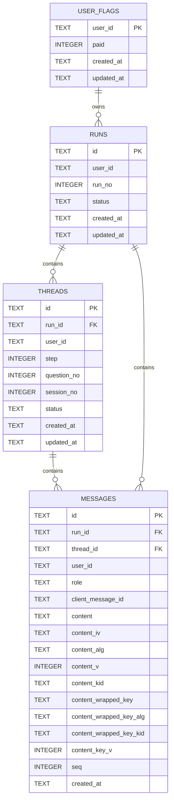

# 30_データモデル

本章では、Cloudflare D1（SQLite互換）に保存するデータの構造（テーブル、主要カラム、関係、制約、インデックス、トリガー）を示す。  
本リポジトリにおけるスキーマの正（canonical）は `database/DDL.sql` とする。

---

## テーブル一覧

- `runs`  
  ユーザーごとの「プログラム実行単位」。やり直し（複数回実行）に対応するための最上位の単位。

- `threads`  
  1ページ=1スレッド。Step1 の設問、または Step2 の日次セッション（テーマ）を表す。

- `messages`  
  thread 内の会話ログ。順序は `seq`（連番）で厳密に管理する。

- `user_flags`  
  ユーザー単位のフラグ（例: `paid`）を保持する。

---

## ER（関係図）



---

## 共通方針

### 外部キー制約
- `PRAGMA foreign_keys = ON;` を前提とし、参照整合性を DB で担保する。
- `runs` → `threads` → `messages` は `ON DELETE CASCADE` により、上位削除で下位も削除される。

### 日時カラム
- `created_at` / `updated_at` は `TEXT` として保持し、SQLite の `datetime('now')` を用いる。
- 形式は SQLite 標準（例: `YYYY-MM-DD HH:MM:SS`）を想定する。
- 画面表示やタイムゾーン変換はアプリケーション側で扱う。

---

## 暗号化方針（封筒暗号）

本システムでは、本文を D1 に平文保存しないために、本文を共通鍵（DEK: Data Encryption Key）で暗号化し、さらにその DEK を別系統の鍵（KEK: Key Encryption Key）で暗号化（ラップ）する **封筒暗号** を前提とする。

- **D1（messages.content 等）**: 本文は暗号文（ciphertext）のみ
- **D1（暗号メタ）**: 暗号方式、IV/nonce、バージョン、鍵識別子、および「ラップ済みDEK（wrapped DEK）」等
- **KMS/HSM（例: AWS KMS）**: KEK（マスター鍵）を保持・管理（ローテーション/監査）。DBに保存するのはラップ済みDEKであり、KEKそのものはDBに置かない

注記:
- `database/DDL.sql` がスキーマの正（canonical）であり、本章の暗号メタ要件（ラップ済みDEK等）を含む。

### updated_at の自動更新
- `runs` / `threads` / `user_flags` は、UPDATE 後に `updated_at` を自動更新するトリガーを持つ。  
  「無限再帰」を避けるため、`WHEN NEW.updated_at = OLD.updated_at` のガードを付ける。

---

## 各テーブル定義（要点）

### runs

**目的**: ユーザーごとの実行単位（1,2,3...）を管理し、「やり直し」に対応する。  
**主キー**: `id`（TEXT）

| カラム | 型 | 必須 | 既定値 | 説明 |
|---|---:|:---:|---|---|
| id | TEXT | ✓ | - | run ID |
| user_id | TEXT | ✓ | - | ユーザー識別子 |
| run_no | INTEGER | ✓ | - | ユーザー内の連番（1,2,3,...） |
| status | TEXT | ✓ | 'active' | `active` / `completed` |
| created_at | TEXT | ✓ | datetime('now') | 作成時刻 |
| updated_at | TEXT | ✓ | datetime('now') | 更新時刻 |

**制約**
- `CHECK (status IN ('active', 'completed'))`

**インデックス**
- **1ユーザー1アクティブ**: `idx_runs_user_active`（部分ユニーク）  
  `UNIQUE (user_id) WHERE status='active'`
- **ユーザー内run_no一意**: `idx_runs_user_run_no`（ユニーク）  
  `UNIQUE (user_id, run_no)`

**トリガー**
- `trg_runs_updated_at`: UPDATE 時に `updated_at` を `datetime('now')` へ更新（ガード付き）

---

### threads

**目的**: 1ページ=1スレッド。Step1 設問、または Step2 日次セッションを表す。  
**主キー**: `id`（TEXT）  
**外部キー**: `run_id` → `runs.id`（`ON DELETE CASCADE`）

| カラム | 型 | 必須 | 既定値 | 説明 |
|---|---:|:---:|---|---|
| id | TEXT | ✓ | - | thread ID |
| run_id | TEXT | ✓ | - | 所属 run |
| user_id | TEXT | ✓ | - | ユーザー識別子 |
| step | INTEGER | ✓ | - | 1 または 2 |
| question_no | INTEGER | 条件 | - | Step1 の設問番号（step=1 の場合のみ） |
| session_no | INTEGER | 条件 | - | Step2 のセッション番号（step=2 の場合のみ） |
| status | TEXT | ✓ | 'active' | `active` / `completed` |
| created_at | TEXT | ✓ | datetime('now') | 作成時刻 |
| updated_at | TEXT | ✓ | datetime('now') | 更新時刻 |

**制約**
- `CHECK (step IN (1, 2))`
- `CHECK (status IN ('active', 'completed'))`
- Stepに応じた整合性（排他制約）  
  ```sql
  CHECK (
    (step = 1 AND question_no IS NOT NULL AND session_no IS NULL) OR
    (step = 2 AND session_no IS NOT NULL AND question_no IS NULL)
  )
  ```

**インデックス**
- **1run1アクティブthread**: `idx_threads_run_active`（部分ユニーク）  
  `UNIQUE (run_id) WHERE status='active'`
- **run内の一意性（Step1）**: `idx_threads_run_step_question`（部分ユニーク）  
  `UNIQUE (run_id, step, question_no) WHERE step=1`
- **run内の一意性（Step2）**: `idx_threads_run_step_session`（部分ユニーク）  
  `UNIQUE (run_id, step, session_no) WHERE step=2`
- **よくある検索**  
  - `idx_threads_user_created` : `(user_id, created_at)`  
  - `idx_threads_run_created` : `(run_id, created_at)`

**トリガー**
- `trg_threads_updated_at`: UPDATE 時に `updated_at` を `datetime('now')` へ更新（ガード付き）

---

### messages

**目的**: thread 内の会話ログを保持する。順序は `seq` で厳密に管理する。  
**主キー**: `id`（TEXT）  
**外部キー**:
- `run_id` → `runs.id`（`ON DELETE CASCADE`）
- `thread_id` → `threads.id`（`ON DELETE CASCADE`）

| カラム | 型 | 必須 | 既定値 | 説明 |
|---|---:|:---:|---|---|
| id | TEXT | ✓ | - | message ID |
| run_id | TEXT | ✓ | - | 所属 run |
| thread_id | TEXT | ✓ | - | 所属 thread |
| user_id | TEXT | ✓ | - | ユーザー識別子 |
| role | TEXT | ✓ | - | `user` / `assistant` |
| client_message_id | TEXT | ✓ | - | クライアント生成の冪等キー |
| content | TEXT | ✓ | - | 暗号文（ciphertext） |
| content_iv | TEXT | ✓ | - | 暗号化に使用したIV/nonce |
| content_alg | TEXT | ✓ | - | 暗号方式（例: `AES-256-GCM`） |
| content_v | INTEGER | ✓ | 1 | 暗号フォーマットのバージョン |
| content_kid | TEXT | 任意 | - | 鍵識別子（ローテーション用） |
| seq | INTEGER | ✓ | - | thread 内の厳密な順序（連番） |
| created_at | TEXT | ✓ | datetime('now') | 作成時刻 |

**封筒暗号メタ（必須）**

実装上、本文を復号可能にするためには DEK（共通鍵）が必要になる。DEKは平文で保存せず、KEKにより暗号化（ラップ）して保存する。

- `content_wrapped_key`: ラップ済みDEK（base64）
- `content_wrapped_key_alg`: ラップ方式（例: `KMS` / `RSA-OAEP` 等）
- `content_wrapped_key_kid`: KEK識別子（例: KMS Key ID/ARN）
- `content_key_v`: 鍵メタのバージョン

**制約**
- `CHECK (role IN ('user', 'assistant'))`
- `UNIQUE (thread_id, client_message_id)`（同一メッセージの再保存を防ぐ）

**重要事項（順序）**
- **並び順は `created_at` に依存しない**。  
  thread 内の順序は `seq` を正とする（同時刻発生や遅延を考慮）。

**インデックス**
- **thread内の順序一意**: `idx_messages_thread_seq`（ユニーク）  
  `UNIQUE (thread_id, seq)`
- **thread内の冪等キー一意**: `idx_messages_thread_client_message_id`（ユニーク）  
  `UNIQUE (thread_id, client_message_id)`
- **よくある検索**  
  - `idx_messages_user_created` : `(user_id, created_at)`  
  - `idx_messages_run_created` : `(run_id, created_at)`  
  - `idx_messages_thread_created` : `(thread_id, created_at)`

**トリガー**
- なし（`updated_at` を持たないため）

---

### user_flags

**目的**: ユーザー単位のフラグを保持する（例: 有料状態）。  
**主キー**: `user_id`（TEXT）

| カラム | 型 | 必須 | 既定値 | 説明 |
|---|---:|:---:|---|---|
| user_id | TEXT | ✓ | - | ユーザー識別子（主キー） |
| paid | INTEGER | ✓ | 0 | 有料状態（0/1） |
| created_at | TEXT | ✓ | datetime('now') | 作成時刻 |
| updated_at | TEXT | ✓ | datetime('now') | 更新時刻 |

**制約**
- `CHECK (paid IN (0, 1))`

**トリガー**
- `trg_user_flags_updated_at`: UPDATE 時に `updated_at` を `datetime('now')` へ更新（ガード付き）

---

## 代表的なクエリパターン（設計上の意図）

- **現在進行中の run を取得**  
  `runs` は「1ユーザー1active」を部分ユニークで保証しているため、`WHERE user_id=? AND status='active'` で一意に取れる。

- **現在進行中の thread を取得（1run1active）**  
  `threads` も同様に `WHERE run_id=? AND status='active'` で一意に取れる。

- **thread の会話ログを取得（順序保証）**  
  `messages` は `WHERE thread_id=? ORDER BY seq` を前提とする。

---

## 参照
- `10_アーキテクチャ`: データの所有権（正の管理主体）
- `40_課金と利用権限`: paid の判定と更新経路（Webhook）

---

## 参考（D1外の派生データ: ベクトルDB）

ベクトル検索（RAG）用の派生データは D1 ではなく Vector DB（例: Qdrant）に保存する。

- **保持するもの**: embedding と、検索に必要な最小メタデータ（例: `user_id`, `thread_id`, `message_id`, `chunk_no`）
- **チャンク本文**: ベクトルDBを活かすため payload として平文を含みうる（本文と同等に機微情報として扱う）
- **正（canonical）**: 本文の正は D1（暗号文）。ベクトルDBは検索インデックスであり、削除や退会は双方へ反映する
