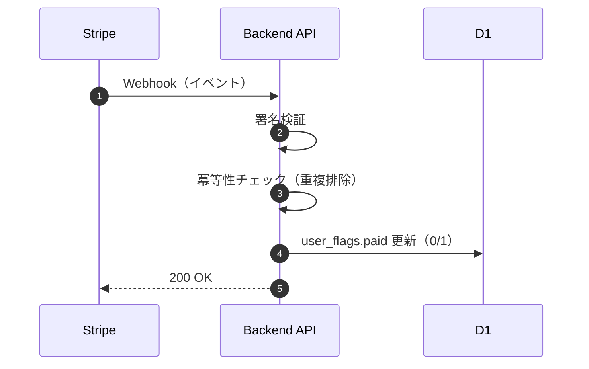

# 40_課金と利用権限

本章では、有料化（課金）と、それに基づく利用権限（無料/有料の機能差）の扱いを定義する。  
決済の正は Stripe、サービス内で参照する運用上の正は D1 の `user_flags.paid` とする。

---

## 用語と前提

- **paid**: ユーザーが有料利用可能であることを示すフラグ（0/1）
- **決済の正（source of truth）**: Stripe
- **運用上の参照点（APIが参照する正）**: D1 の `user_flags.paid`

> 本章は「課金のUI（Checkout/Portal）」や「会員基盤のUI（ログイン画面）」は扱わない。  
> バックエンド API が扱う「支払い状態の反映」と「権限判定」を対象とする。

---

## 目的

- Stripe の支払い結果を、サービス内の利用権限（paid）へ反映する
- paid によって API の利用可否/範囲を制御できる状態にする
- Webhook の再送や重複を前提に、**冪等性**を担保する
- 反映遅延・失敗時に、ユーザー体験を破綻させない運用を可能にする

---

## データモデル（参照）

- `user_flags`  
  - `paid INTEGER NOT NULL DEFAULT 0 CHECK (paid IN (0,1))`
  - `updated_at` はトリガーで自動更新

詳細は `30_データモデル` を参照。

---

## 利用権限（無料/有料の機能差）

本サービスでは、ユーザーの paid 状態に応じて、機能の提供範囲を切り替える。  
具体的な差分はフロントエンド側の導線にも依存するため、ここではバックエンド側で扱う最小限の原則を定義する。

### 原則
- **無料ユーザー**: 無料範囲の API のみ利用可能
- **有料ユーザー（paid=1）**: 有料範囲の API を利用可能

### 典型的な制御ポイント（例）
- thread/run の開始回数や、Step2（日次セッション）の利用可否
- messages 取得の範囲（期間・件数）
- LLM 関連エンドポイント（`/api/thread/chat`, `/api/llm/respond`, `/api/llm/ping`）の利用制限

#### メッセージ処理との整合（中継方式）

- `POST /api/thread/chat` は平文をLLMへ中継するが、平文を永続化しない。
- 履歴保存は `POST /api/thread/message` による暗号文保存経路で行う。
- paid 判定は上記2経路の双方に適用し、課金ポリシーと保護方針を一貫させる。

> 実際の制御対象を確定する際は、フロントエンドの導線と合わせて「どのAPIをゲートするか」を `20_API仕様` に追記する。

---

## paid 判定 API

### `GET /api/paid`
- **目的**: 認証ユーザーの paid 状態を返す
- **運用上の正**: D1 の `user_flags.paid`
- **典型用途**: フロントエンドが画面表示/導線分岐のために参照

レスポンス例:
```json
{ "ok": true, "paid": true }
```

---

## paid の更新経路

### 経路A: Stripe Webhook（本命の更新経路）
- Stripe のイベントを受け取り、署名検証後に `user_flags.paid` を更新する。
- Webhook は **再送・重複** がある前提で、冪等性を必須要件とする。

### 経路B: 管理用途の手動更新（暫定/運用用途）
- `POST /api/admin/set_paid` により、管理用途で `user_flags.paid` を更新する。
- 本番運用では誤用防止のため、強い制限（管理者のみ、環境限定、IP制限等）を推奨。

---

## Stripe Webhook 設計

> 本章では、課金状態反映の設計上の必須要件を定義する。  
> セキュリティ実装上の詳細（署名ヘッダ、Secrets 管理など）は `50_セキュリティ` と整合させる。

### 対象イベント
- MVP では `checkout.session.completed` を課金反映イベントとして採用する。
- 対象イベントを拡張する場合は、本章・`20_API仕様`・`50_セキュリティ` を同時に更新し、反映条件を明文化する。

### 処理フロー（概略）

- Checkout Session 作成時に、Memberstack の memberId を `client_reference_id` に設定する。
- Webhook 側は `client_reference_id` を唯一の識別子として `user_id` に反映する（フォールバックは行わない）。



---

## 冪等性（Webhook 再送・重複への対応）

Webhook は、ネットワーク都合や Stripe 側の仕様により **同一イベントが複数回届く**。  
そのため「同じイベントを何回処理しても結果が同じ」ことを担保する。

### 推奨戦略
- **イベントID（Stripe event.id）** を一意キーとして、処理済みを記録する
- すでに処理済みなら DB 更新を行わず 200 を返す

この要件を満たすため、処理済みイベントを保持する冪等性記録（例: `stripe_webhook_events`）を必須とする。

---

## 失敗時の扱い（反映遅延・不整合）

### 反映遅延（支払い直後に paid がまだ 0）
起こり得る理由:
- Webhook 到達遅延
- 署名検証失敗や一時障害による処理遅延
- フロントエンドが先に `/api/paid` を叩いた

推奨の取り扱い:
- フロント側は「支払い完了後、数秒〜数十秒で反映される可能性」を前提にする
- 一定時間（例: 数十秒）リトライ、または「反映待ち」画面を用意する
- それでも反映されない場合はサポート導線へ

### 不整合（Stripe は有料だが D1 が paid=0 のまま）
- Webhook を再送できる設計にしておく（Stripe ダッシュボードから再送）
- 管理用途の `admin/set_paid` を最終手段として保持する（ただし強い制限をかける）

---

## セキュリティ前提（本章の要点）

- Webhook は **署名検証が必須**
- `admin/set_paid` は強い制限が必須（管理者のみ、環境限定など）
- paid の判定に用いる `user_id` の真正性（なりすまし防止）は `50_セキュリティ` で定義する

---

## 参照
- `20_API仕様`: `/api/paid`, `/api/admin/set_paid` を含むエンドポイント契約
- `30_データモデル`: `user_flags` の定義
- `50_セキュリティ`: Webhook 署名検証、認証、Secrets の扱い
- `60_利用制限と運用ポリシー`: 管理操作の取り扱い、悪用対応
